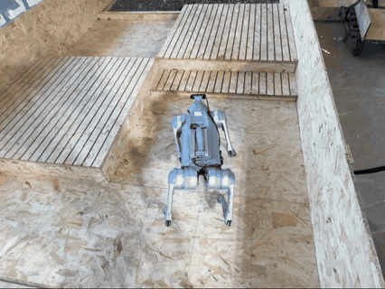
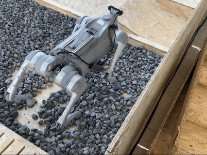
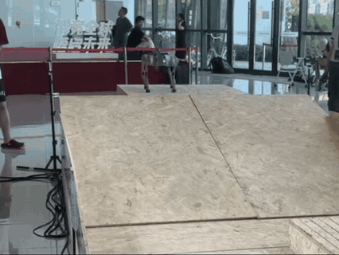
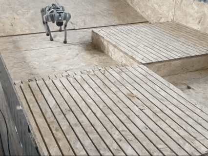

# Kaiwu Final Stage · 四足机器人自主导航与 Sim2Real 部署

本项目面向四足机器人自主导航，构建了一条从特权仿真训练到真机部署的完整 Sim-to-Real 管线：

- 在腾讯开悟的 Isaac Lab 仿真环境中，用高度扫描等特权观测训练 PPO 教师策略；
- 通过行为蒸馏 / LBC，把教师能力迁移到以 D435i 深度图像为输入的视觉学生策略；
- 将视觉学生导出为 ONNX，经 Python↔ONNX 数值对拍验证后随部署配置下发；
- 部署到 Unitree Go2 + Jetson，由 50 Hz C++ 运行时实时推理并输出 12 维关节动作。

仓库内包含完整的训练 / 蒸馏 / 导出 / 部署代码与全过程分析记录；项目已在 Go2 真机上完成固定指令与 UWB 模式的行走验证，并沉淀出训练-部署接口契约、版本化 checkpoint 与分级验证体系。

**平台：** Unitree Go2 · Intel RealSense D435i · Jetson · 腾讯开悟仿真平台

**🏁 赛程系列仓库**

- [初赛 · kaiwu-prelim-vacuum](https://github.com/nanbloom001/kaiwu-prelim-vacuum) — 清扫大作战 RL 智能体，PPO 学习清扫与自主充电策略
- [复赛 · kaiwu-semi-locomotion](https://github.com/nanbloom001/kaiwu-semi-locomotion) — Go2 四足仿真训练，PPO 地形穿越与迷宫导航

[](./LICENSE)

---

## 项目展示

<div align="center">

 

 

</div>

---

## 已完成功能

### 训练：从特权教师到深度视觉学生

- [x] 高度扫描特权教师 PPO，行为蒸馏 / LBC / 视觉 PPO 蒸馏管线
- [x] D435i 深度视觉学生，180×320×1 深度输入，depth→CNN→LSTM 编码
- [x] 版本化 checkpoint，支持阶段 / 时钟 / RNG / 优化器精确恢复
- [x] 单测回归 165 项通过，容器 full-smoke 可重复执行

### 部署：Sim2Real 真机闭环

- [x] ONNX 导出与数值对拍，200 帧 LSTM 状态回灌无 NaN
- [x] Go2 / Jetson 50Hz C++ 推理运行时，LSTM 逐帧回喂、指令覆写
- [x] D435i 深度 + UWB / 固定指令多指令源，含 UWB 标定与监控工具
- [x] 真机行走验证通过，部署制品 SHA256 清单化管理

### 系统扩展与生产化

- [x] 高低层导航架构，从高层导航策略到低层视觉运控的指令链路
- [x] P1.5 低层 PPO 与响应器联合训练，独立优化器与梯度
- [x] P2 连续高层 PPO，取代 Oracle / 离散词表
- [x] 迷宫导航系列，覆盖 10Hz 控制、闭环策略、即时指令与卡住恢复
- [x] P4.5 / P5 稳定方向 4h / 8h 长训，完成迷宫路线最终训练
- [x] 真机诊断与运行时加固，力矩日志、启动平滑与幂等收尾

### 下一步

- [ ] 高低层 / 迷宫路线的部署闭环，nav.onnx 导出与组合 checkpoint 导出器，Jetson 发布
---

## 系统架构

<!-- TODO：补充系统架构图（建议采用横向三段流：训练 server/ → ONNX 导出 → 部署 deploy/，底部以接口契约虚线约束两端） -->

---

## 关键问题

### 1. 训练与部署的观测契约不一致

首次真机部署时发现，训练中取值范围为 [0,1] 的归一化目标距离，在部署配置里被写成 10（越界近 10 倍），数值对照证明该输入会显著改变关节动作；同时官方导出脚本只支持无 goal 的 Standard 模型，带 goal 的 Track 模型需要自定义导出链路。

**解决方式**
- 按训练定义重写部署 goal，并在导出时强制 Python↔ONNX 数值对拍
- 固化 Standard（Actor77，无 goal）与 Track（Actor80，带 goal）两种模型契约，导入导出前强制核对结构
- 每个部署树的制品清单记录 checkpoint 与 deploy.yaml 同源校验

### 2. 固定指令模式下「目标点」其实是移动的

配置正前方 1m 的固定目标后，机器狗行走超过 10m 仍未停止。训练中目标每帧按世界坐标与机器人位姿重算、接近时距离递减到 0；部署端没有世界定位，每帧传入同一个值，语义变成「目标永远在正前方 1m」——一个随狗移动的虚拟目标；且固定指令分支本身没有停车逻辑。

**解决方式**
- 明确 goal 只提供方向与距离条件，不承担停车职责
- 停车由 UWB / 规则允许的定位持续更新目标，并在控制器侧实现到达判定、减速与停止
- 部署树提供 fixed / uwb / nav 三种指令源切换

<details>
<summary>更多工程问题</summary>

**特权观测缺失导致 OOD 满速**：部署环境没有高度扫描，全零观测被误判为平地、下发满速命令，超出教师训练分布导致卡楼梯；通过无扫描降速兜底（回退到训练分布内的命令）解决。

**配置声明与运行时契约脱节**：固定学习率被参数透传静默吞掉，实际训练使用了默认自适应调度；通过修复接口契约并增加每次更新后的运行时校验（偏离即中止）解决。

</details>

---

## 使用说明

### 环境要求

- 训练端：Python 3.11 + PyTorch + pytest；真实训练需腾讯开悟平台容器环境
- 部署端：Jetson（aarch64）+ ONNX Runtime + CMake + RealSense SDK；模型权重不入库，按部署树 ARTIFACTS.md 记录的 SHA256 获取或导出

### 快速开始

```bash
cd server
python -m pytest agent_ppo/tests -q           # 本地单元测试
python train_test.py                          # 训练入口（平台环境）
python local_sync_client.py --check-local     # 离线同步自检
```

### 训练

- 活动训练阶段与配置链见 [server/README.md](./server/README.md)，变更记录见 [server/CHANGELOG.md](./server/CHANGELOG.md)
- 配置链：`policy_entry` → StageConfig 注册表 → 训练 TOML；模型架构维度来自 StageConfig，checkpoint 统一 kaiwu_train_v1 schema

### 仿真与评估

- 评估入口显式指定 `policy_entry`（视觉评估为 `visual_policy_optimization`），只加载视觉编码器与低层 Actor
- 容器 smoke：`python3 -m agent_ppo.tools.nav_full_smoke start --num-envs 8`

### 真机部署

- 默认路线 [deploy/sim2real_test_loco](./deploy/sim2real_test_loco)，部署前必读对应 ARTIFACTS.md 并核对 SHA256
- preflight：`./scripts/run_loco_stage_fixed_test.sh --check`
- ONNX 导出：`python export_loco_onnx.py --ckpt <ckpt> --out <onnx>`（opset 17，含数值对拍）
- 真机验证顺序：悬空测试 → 低速平地 → 逐步增加速度与场景

### 配置说明

- Standard（Actor77，无 goal）与 Track（Actor80，带 goal）两种模型契约不可混用
- 速度指令与 goal 是不同输入；固定 goal 不等于到点停车
- 相机内参 / 外参须与真机安装一致；深度相机不是高度扫描的直接文件替换

### 仓库结构

| 目录 | 职责 |
|---|---|
| server/ | 训练工程（PPO / 蒸馏 / 视觉 / P1.5）、checkpoint、平台同步 |
| deploy/ | ONNX 导出、C++ 推理、D435i 深度、UWB / 固定指令、诊断脚本 |
| shared/ | 接口契约、规则镜像、分析记录、Bug 台账 |
| archive/ | 历史训练代码与冻结部署包（仅供追溯） |

### 常见问题

- 部署目录存在 ≠ 制品齐备：以 ARTIFACTS.md 与 preflight 结果为准
- Git LFS pointer 只是制品引用，部署前检查实际文件类型与 SHA256
- 修改网络输入 / 观测顺序 / goal / checkpoint / ONNX I/O 时，须同一 PR 原子更新训练端、部署端与接口契约
- 同步与 Cookie 问题见 [server/README.md](./server/README.md)

### 更多文档

- [官方规则与开发文档](./shared/规则说明/README.md) · [接口契约](./shared/interfaces/server-deploy-contract.md)
- [模型、训练与部署分析](./shared/分析记录/) · [Bug 修复台账](./shared/分析记录/Bug修复台账.md)
- [仓库协作规范](./CONTRIBUTING.md) · [AI Agent 操作规则](./AGENTS.md)

> 术语：fwwb = 仓库工作目录名；LBC = Learning By Cheating 行为蒸馏；Sim2Real = 仿真到真机迁移；Actor77 / Actor80 = 两种部署模型契约。
