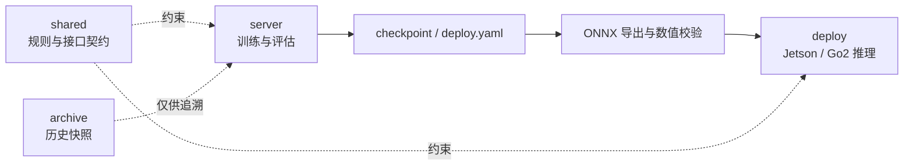

# Kaiwu Final Stage

腾讯开悟四足机器人自主导航赛题的训练与 Sim-to-Real 部署仓库，面向 Unitree Go2、Intel RealSense D435i 和 Jetson 部署环境。

本仓库同时维护服务器训练工程、真机部署工程、跨端接口资料与历史归档。训练端和部署端各自独立运行，通过明确的模型、观测和制品契约保持一致。

## 项目目标

- 在仿真环境中训练四足机器人运动与目标跟踪策略。
- 使用高度扫描等特权信息训练教师表示，并将能力蒸馏到使用深度图像的视觉学生模型。
- 将视觉策略导出为 ONNX，在 Go2/Jetson 上接入 D435i、机器人本体状态和目标信息完成实时推理。
- 保持训练配置、checkpoint、ONNX、部署参数和真机运行行为可追溯、可验证、可回滚。

## 系统关系



`shared/` 和 `archive/` 只提供资料与追溯依据，不得成为 `server/` 或 `deploy/` 的运行时依赖。

## 仓库结构

```text
Kaiwu_Final_Stage/
├── server/      # 腾讯开悟服务器训练工程
├── deploy/      # Go2 / Jetson 真机部署工程
├── shared/      # 规则、接口契约、分析报告与项目资料
├── archive/     # 历史代码、旧部署包与冻结资料
├── AGENTS.md    # AI Agent 强制操作规则
├── CONTRIBUTING.md
└── README.md
```

| 目录 | 主要内容 | 运行约束 |
|---|---|---|
| [`server/`](./server/) | PPO、LBC、行为蒸馏、视觉编码器、训练配置、Isaac 环境封装 | 必须以 `server/` 为工作目录独立运行 |
| [`deploy/`](./deploy/) | ONNX 导出、C++ 推理、D435i 深度输入、UWB/固定指令、诊断与启动脚本 | 每套部署目录独立运行，不导入 `server/` |
| [`shared/`](./shared/) | 官方规则镜像、跨端接口、模型与部署分析、协作文档 | 仅作资料，不参与运行时 import |
| [`archive/`](./archive/) | 历史训练代码、旧模型资料和原始部署包 | 不得被活动训练或部署代码引用 |

### 平台托管源码本地镜像

Isaac Lab、Unitree RL Lab、Unitree ROS 和开悟平台运行入口的本地查询镜像位于
`shared/arena_frontend_monitor/runtime/container_source_mirror/`。镜像数据由 Git 忽略，
不得作为训练或部署运行时依赖，也不提交到仓库；仓库只保存刷新工具和使用规则：
[`shared/container_source_mirror/README.md`](./shared/container_source_mirror/README.md)。

涉及平台地形、课程、传感器、重置逻辑或运行框架的排查，应先检查镜像
`mirror_manifest.json` 的生成时间、来源根和 SHA256，再读取相关文件。镜像不能证明当前
容器动态状态；结论依赖运行时对象、张量 shape 或当前补丁时，仍需通过 RPC 在线复核。

## 训练工程

训练项目位于 [`server/`](./server/)，主要组成如下：

| 路径 | 说明 |
|---|---|
| `server/agent_ppo/` | PPO、LBC、视觉蒸馏和策略网络实现 |
| `server/agent_diy/` | DIY Agent 基线与参考实现 |
| `server/conf/` | 算法、应用、训练环境和同步配置 |
| `server/isaac_env/` | Isaac Lab 环境封装 |
| `server/train_test.py` | 训练入口 |
| `server/docs/` | 实验说明与评估记录 |
| `server/CHANGELOG.md` | 当前训练主线变更记录 |

训练必须从 `server/` 启动：

```bash
cd server
python train_test.py
```

具体训练环境、腾讯开悟同步方式和配置约定见 [`server/README.md`](./server/README.md)。

## 部署工程

默认部署路线为 [`deploy/sim2real_test_loco/`](./deploy/sim2real_test_loco/)，用于视觉学生策略的 Go2/Jetson 集成与固定指令、UWB 模式验证。

| 部署目录 | 定位 | 当前使用要求 |
|---|---|---|
| [`sim2real_test_loco`](./deploy/sim2real_test_loco/) | 默认视觉运动部署路线，Actor80，goal 参与策略计算 | 部署前补齐或生成 ONNX、C++ 二进制和 ONNX Runtime |
| [`sim2real_test_st7`](./deploy/sim2real_test_st7/) | ST7 视觉蒸馏实验路线 | 制品不完整，不可直接部署 |
| [`sim2real_test_st9`](./deploy/sim2real_test_st9/) | UWB 指令与深度滤波实验路线 | 需按清单补齐运行制品 |
| [`sim2real_test_standard`](./deploy/sim2real_test_standard/) | standard locomotion 路线，Actor77，不使用 goal | 与 Actor80 模型不兼容，且当前制品不完整 |

部署目录存在不代表可以直接启动。每次部署前必须先读取对应的 `ARTIFACTS.md`，确认 checkpoint、ONNX、二进制、运行库、配置和 SHA256 状态。

默认路线检查入口：

```bash
cd deploy/sim2real_test_loco
./scripts/run_loco_stage_fixed_test.sh --check
```

详细制品和 ONNX I/O 定义见 [`deploy/sim2real_test_loco/ARTIFACTS.md`](./deploy/sim2real_test_loco/ARTIFACTS.md)。

## 模型与观测边界

- 训练阶段可以使用高度扫描等特权观测作为教师信息；真机策略必须依赖 D435i 深度、本体状态及规则允许的目标信息。
- 默认视觉模型使用 `180 × 320 × 1` 深度输入、45 维 proprio、视觉时序状态和 goal 条件；精确字段与 shape 以部署 `ARTIFACTS.md` 和接口契约为准。
- Actor80 使用 `proprio(45) + latent(32) + goal(3)`；Actor77 不包含 goal。两种 checkpoint、导出器和部署运行时不能直接混用。
- 速度 command 与 goal 是不同输入。固定 goal 只为策略提供方向和距离条件，不等同于到点停车逻辑。
- 使用真实坐标目标时，需要由 UWB 或经比赛允许的位置来源持续更新 goal，并由控制器实现到达判定、减速和停止。
- 相机内参影响深度投影，外参描述相机相对机器人机身的安装位姿。训练配置必须使用与真机安装一致的标定参数。

跨端字段、模型和配置的统一入口为 [`shared/interfaces/server-deploy-contract.md`](./shared/interfaces/server-deploy-contract.md)。该文件未完成的条目不得依靠经验猜测后直接部署。

## 制品管理

一次可复现部署至少应明确以下内容：

- checkpoint 来源、文件名和 SHA256；
- 与 checkpoint 同源的 `deploy.yaml`；
- ONNX 导出脚本、opset、输入输出名称和 shape；
- LSTM 状态初始化、逐帧回喂和 episode reset 语义；
- Jetson C++ 二进制及其构建来源；
- ONNX Runtime、RealSense SDK 等运行依赖；
- 相机标定、命令来源和最近一次验证结果。

Git LFS pointer 只是制品引用，不是真实 checkpoint、ONNX 或动态库。部署前必须检查实际文件类型、大小和 SHA256，不能把百字节左右的 pointer 当成可加载模型。

## 重要说明

1. **默认路线不等于制品自动齐备。** 是否可部署以对应 `ARTIFACTS.md` 和 preflight 结果为准。
2. **训练与部署必须保持同一契约。** 修改网络输入、观测顺序、归一化、goal、checkpoint、ONNX I/O 或 `deploy.yaml` 时，必须同时更新训练端、部署端和接口文档。
3. **深度相机不是高度扫描的直接文件替换。** 视觉学生需要通过训练或蒸馏学习从深度图像恢复教师策略所需的地形表示。
4. **goal 不负责自动停车。** 到点停止需要实时定位、距离判断和控制器状态逻辑。
5. **真机测试必须先做安全检查。** 先完成离线导出校验、`--check`、悬空测试和低速平地测试，再逐步增加速度与场景复杂度。
6. **历史目录只用于追溯。** 活动代码不得依赖 `archive/`，新功能也不得直接在归档副本上开发。

## 文档入口

- [官方规则与开发文档](./shared/规则说明/README.md)
- [训练工程说明](./server/README.md)
- [默认部署制品清单](./deploy/sim2real_test_loco/ARTIFACTS.md)
- [server–deploy 接口契约](./shared/interfaces/server-deploy-contract.md)
- [模型、训练与部署分析](./shared/分析记录/)
- [Bug 修复台账](./shared/分析记录/Bug修复台账.md)
- [仓库协作与版本管理规范](./CONTRIBUTING.md)
- [AI Agent 操作规则](./AGENTS.md)

## 协作要求

`main` 只接收完成对应验证的稳定改动。所有开发均从最新 `main` 创建功能分支，通过 PR 合入；普通短期分支使用 squash merge，合并后删除。

开始修改前请阅读 [`CONTRIBUTING.md`](./CONTRIBUTING.md)。AI Agent 必须同时遵守 [`AGENTS.md`](./AGENTS.md)，完成远程 SHA、测试、制品与接口检查后方可推送或合并。
