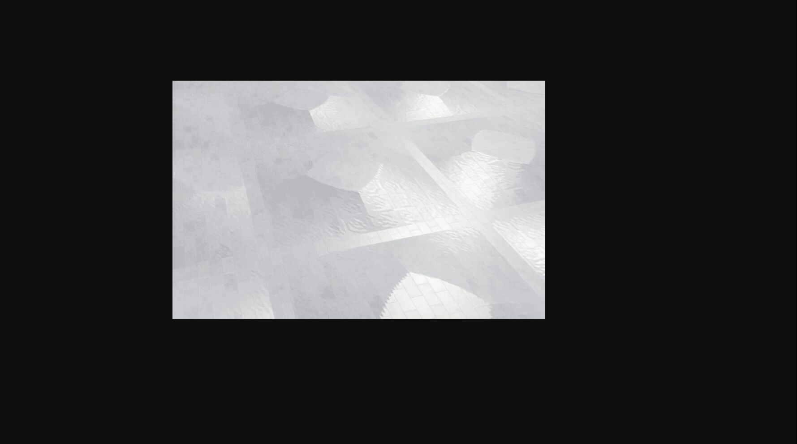
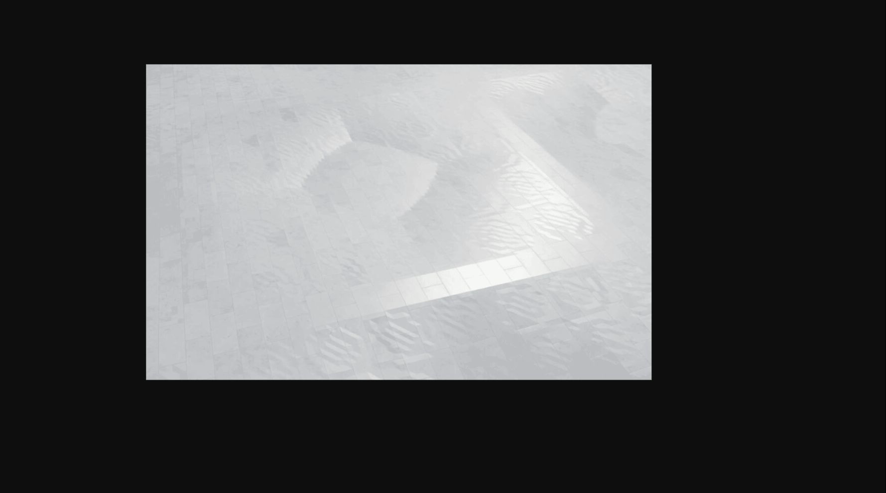
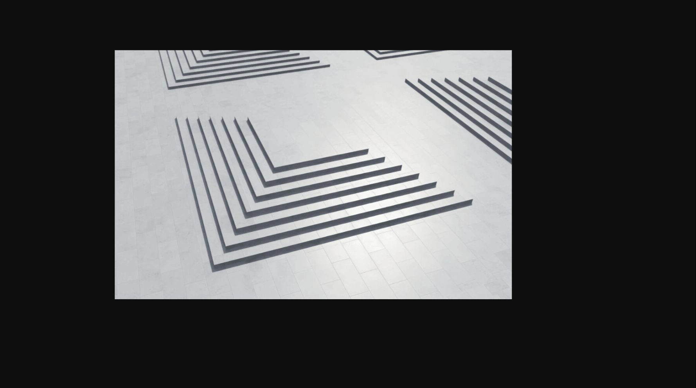
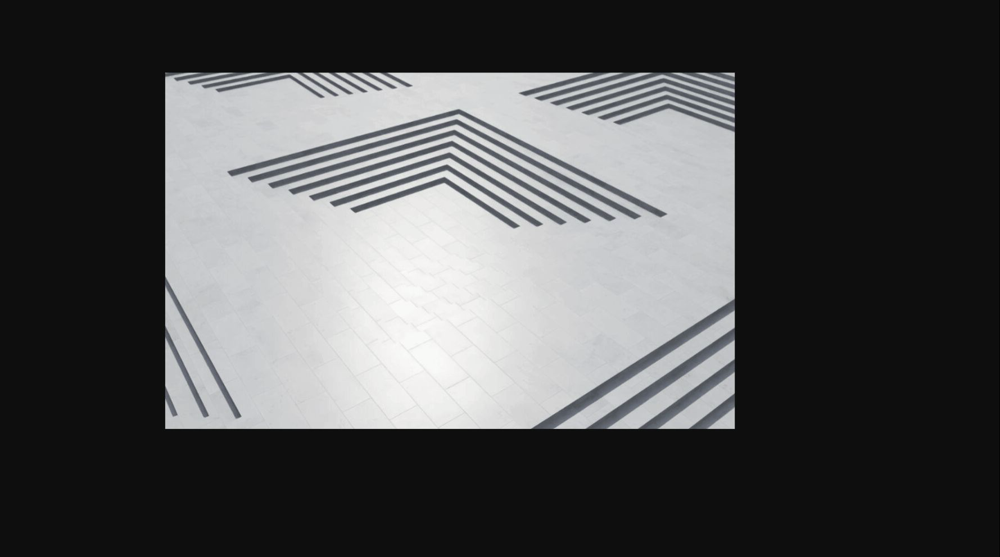
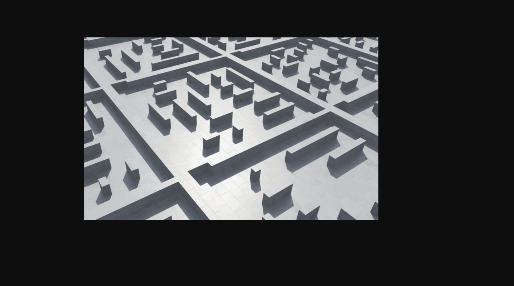
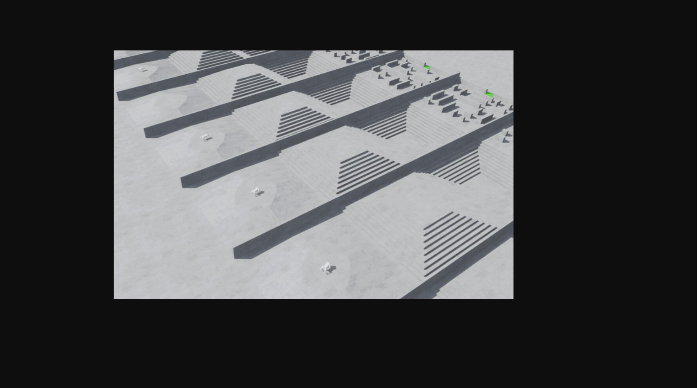
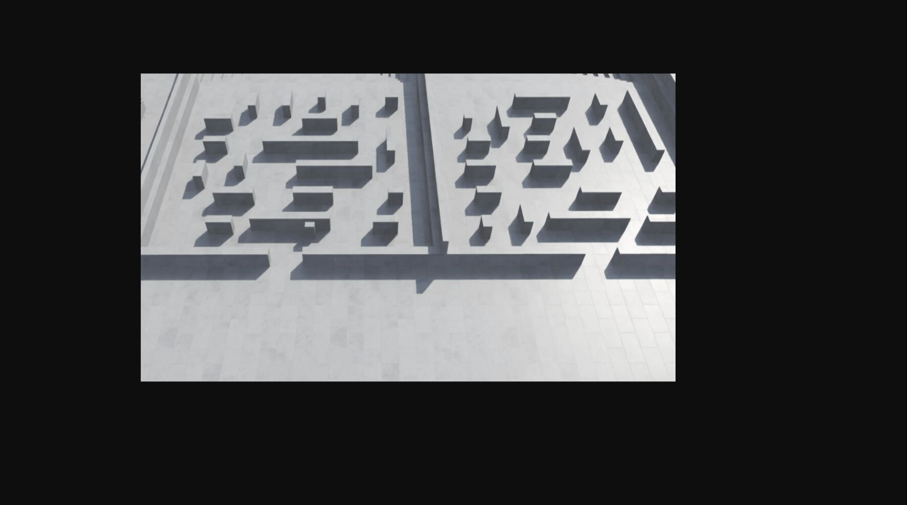

# 项目简介

> Source: https://tencentarena.com/docs/p-competition-legged_robot_competition_26/27.0.21/guidebook/dev-guide/intro/

## 任务目标

本赛题为 四足机器人自主导航 Sim2Real 任务。选手需要在第一阶段仿真训练的基础上，进一步完成视觉观测建模、导航规划、运动控制与真机部署，使 Go2 四足机器人能够在复杂地形赛道中，从起点自主移动到终点，并在整个过程中保持稳定、节能的运动表现。

与通用的四足机器人训练任务不同，本赛题的重点不只是“在仿真里得到高分”，而是让策略具备从仿真迁移到真机的能力。也就是说，选手不仅需要让机器人“能走”，还需要解决以下问题：

- 如何用机载深度相机替代仿真特权观测；
- 如何在复杂赛道中完成导航与运控协同；
- 如何通过标定、建模与部署，尽量缩小 Sim-to-Real 差异；
- 如何让训练得到的模型能够在真机侧稳定运行并完成任务。

## 任务模式

为了支持从基础运控到导航能力的逐步构建，赛题中保留了两种任务模式：

- 标准模式：用于训练和验证机器人在复杂地形上的基础运动控制能力，重点关注“能否稳定行走、能否走穿地形”。
- 赛道模式：用于训练和评估机器人从起点到终点的自主导航能力，是更贴近真机部署任务的模式。

## 环境介绍

### 地形

赛题使用三角网格地形。标准模式下，各子地形按比例分布，用于训练基础运控能力；赛道模式下，多种子地形会串联为单向赛道，用于训练和评估从起点到终点的导航能力。

#### 标准模式地形

| 地形类型 | 说明 | 图例 |
| --- | --- | --- |
| pyramid_slope | 金字塔坡面，向上 |  |
| pyramid_slope_inv | 金字塔坡面，向下 |  |
| pyramid_stairs | 金字塔楼梯，向上 |  |
| pyramid_stairs_inv | 金字塔楼梯，向下 |  |
| maze | 迷宫地形，随机生成高度为 0.5m 的障碍物，地形中至少保持一条从进入边到对边的通路 |  |

标准模式地形示意图：

#### 赛道模式地形

| 地形类型 | 说明 | 图例 |
| --- | --- | --- |
| track | 由多种子地形串联构成的单向赛道：前段为 pyramid_slope、pyramid_slope_inv、pyramid_stairs、pyramid_stairs_inv 的任意排列，末段必须为 open_entry_maze（赛道终点恒为迷宫） |  |
| open_entry_maze | 赛道专用终点地形：迷宫出入口均为开放通道，机器人从进入边行至对边的出口即完成赛道 |  |

赛道模式地形示意图：

### 场景元素

### 元素介绍

| 元素 | 说明 |
| --- | --- |
| Go2 四足机器人 | Go2 四足机器人，共 12 个可控关节，是策略直接控制的对象 |
| 复杂地形 | 包括坡面、楼梯、迷宫和赛道，用于评估机器人在复杂环境中的稳定性与通行能力 |
| 深度相机 | 本阶段的核心感知来源。部署与评测时，机器人需要依赖机载深度相机而非仿真特权地形观测 |
| UWB 标签 | 本阶段与终点相关的观测链路之一，用于支撑更贴近真机场景的任务设定 |

在创建训练任务和评估任务时，上述地形与观测配置方式会有所不同。环境配置细节请参考[开发指南-环境详述](环境详述.md)。

## 仿真阶段计分规则

### 标准模式 (Standard)

目标是在保持稳定与节能的前提下，尽可能走穿当前地形块。

`总分 = 0.4 × Score_forward + 0.2 × Score_time + 0.2 × Score_energy + 0.2 × Score_posture`

| 子项 | 权重 | 含义 |
| --- | --- | --- |
| 前进距离分数 | 0.4 | 从地形块中心出生，按"与出生点的 2D 欧氏距离 / 半块长度"归一化；走到半块即满分（= 走穿：从中心开始穿过半个地形长度） |
| 时间分数 | 0.2 | 仅走穿地形的模型获得，用时越短分越高 |
| 能耗分数 | 0.2 | episode 平均单步关节机械功率的指数衰减，越节能越高 |
| 姿态分数 | 0.2 | episode 平均 roll/pitch 偏移的指数衰减，越平稳越高 |

### 赛道模式（Track）

在限定步数内，以最快、最稳定、最节能的方式从起点到达目标点。

`总分 = 完成系数 × (0.4 × Score_time + 0.4 × Score_posture + 0.2 × Score_energy)`

其中完成系数为当前任务中 完成赛道的机器狗数量占总数的比例：单只机器狗完成赛道记为 1、失败或超时记为 0，对批次内所有机器狗求均值即可。例如并行 1024 只机器狗、其中 512 只走到终点，完成系数 = 0.5。

| 子项 | 权重 | 含义 |
| --- | --- | --- |
| 时间分数 | 0.4 | 用时越短分越高 |
| 姿态分数 | 0.4 | episode 平均 roll/pitch 偏移的指数衰减 |
| 能耗分数 | 0.2 | episode 平均单步关节机械功率的指数衰减 |

## 注意事项

- 任务失败条件：主体或关节接触地面（姿态异常 / 摔倒）。
- 任务超时条件：达到单回合最大步数后仍未完成。
- 标准模式走穿判定：从地形块中心出生后，与出生点的二维欧氏距离达到半块长度减 0.1 米即可判定走穿。默认地形块长度为 8 米，对应阈值约为 3.9 米。
- 赛道模式完成判定：机器人从起点到达终点（目标点）。
- 决赛阶段的感知边界：训练阶段可以使用高程扫描等仿真特权观测；但部署与评估阶段，策略必须依赖机载深度相机与能获取到的自身观测，并处理与真机一致的观测误差与迁移问题。
